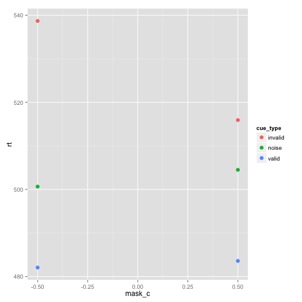
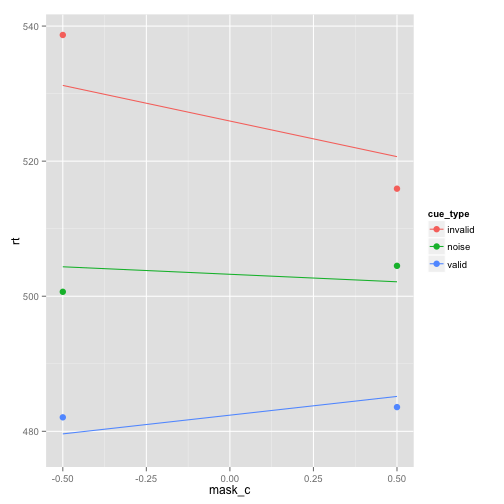

```r
require(lme4)
```

```
## Loading required package: lme4
## Loading required package: lattice
## Loading required package: Matrix
```

```r
require(ggplot2)
```

```
## Loading required package: ggplot2
## 
## Attaching package: 'ggplot2'
## 
## The following object is masked from 'package:lme4':
## 
##     fortify
```

```r

df <- read.csv("dualmask-final.csv")
df.nona <- df[!is.na(df$rt), ]  # remove bad trials so ggplot doesn't get mad
head(df)
```

```
##   subj_id block_ix trial_ix     cue cue_type mask_type       pic up_pic
## 1  MWP201        0        0 gorilla    valid    nomask   gorilla  right
## 2  MWP201        0        1   noise    noise    nomask lightbulb   left
## 3  MWP201        0        2   heart    valid      mask     heart   left
## 4  MWP201        0        3   noise    noise    nomask     camel   left
## 5  MWP201        0        4   noise    noise      mask     heart   left
## 6  MWP201        0        5   noise    noise    nomask     mouse   left
##   response    rt is_correct cue_l  cue_q mask_c
## 1    right 380.7          1  -0.5 -0.333   -0.5
## 2    right    NA          0   0.0  0.667   -0.5
## 3     left 334.1          1  -0.5 -0.333    0.5
## 4     left 472.1          1   0.0  0.667   -0.5
## 5    right    NA          0   0.0  0.667    0.5
## 6     left 332.0          1   0.0  0.667   -0.5
```

```r

# plot just the means
ggplot(df.nona, aes(x = mask_c, y = rt, color = cue_type)) + stat_summary(fun.y = mean, 
    geom = "point", size = 3)
```

 

```r

# fit a model with just the linear interaction
unique(df.nona[, c("cue_type", "cue_l")])
```

```
##    cue_type cue_l
## 1     valid  -0.5
## 4     noise   0.0
## 15  invalid   0.5
```

```r
mod1 <- lmer(rt ~ cue_l * mask_c + (1 | subj_id) + (1 | pic), data = df, REML = FALSE)
summary(mod1)$coefficients
```

```
##              Estimate Std. Error t value
## (Intercept)   502.568     14.476  34.717
## cue_l          42.137      3.989  10.562
## mask_c         -2.966      2.821  -1.052
## cue_l:mask_c  -17.291      7.979  -2.167
```

```r

# model comparison
mod1.chisqr <- anova(mod1, update(mod1, . ~ . - cue_l:mask_c))
mod1.chisqr
```

```
## Data: df
## Models:
## update(mod1, . ~ . - cue_l:mask_c): rt ~ cue_l + mask_c + (1 | subj_id) + (1 | pic)
## mod1: rt ~ cue_l * mask_c + (1 | subj_id) + (1 | pic)
##                                    Df   AIC   BIC logLik deviance Chisq
## update(mod1, . ~ . - cue_l:mask_c)  6 91173 91214 -45580    91161      
## mod1                                7 91170 91218 -45578    91156  4.69
##                                    Chi Df Pr(>Chisq)  
## update(mod1, . ~ . - cue_l:mask_c)                    
## mod1                                    1       0.03 *
## ---
## Signif. codes:  0 '***' 0.001 '**' 0.01 '*' 0.05 '.' 0.1 ' ' 1
```

```r

ggplot(df.nona, aes(x = mask_c, y = rt, color = cue_type)) + stat_summary(fun.y = mean, 
    geom = "point", size = 3) + stat_summary(aes(y = fitted(mod1)), fun.data = mean_se, 
    geom = "line")
```

 

```r

# fit a model with both the linear and the quadratic terms
unique(df.nona[, c("cue_type", "cue_l", "cue_q")])
```

```
##    cue_type cue_l  cue_q
## 1     valid  -0.5 -0.333
## 4     noise   0.0  0.667
## 15  invalid   0.5 -0.333
```

```r
mod2 <- lmer(rt ~ (cue_l + cue_q) * mask_c + (1 | subj_id) + (1 | pic), data = df, 
    REML = FALSE)
summary(mod2)$coefficients
```

```
##              Estimate Std. Error t value
## (Intercept)   502.940     14.492 34.7052
## cue_l          43.066      4.310  9.9918
## cue_q          -1.572      2.849 -0.5518
## mask_c         -6.360      3.131 -2.0310
## cue_l:mask_c  -25.454      8.620 -2.9530
## cue_q:mask_c   14.201      5.698  2.4922
```

```r

# model comparison
mod2.chisqr <- anova(mod2, update(mod2, . ~ . - cue_l:mask_c))
mod2.chisqr
```

```
## Data: df
## Models:
## update(mod2, . ~ . - cue_l:mask_c): rt ~ cue_l + cue_q + mask_c + (1 | subj_id) + (1 | pic) + cue_q:mask_c
## mod2: rt ~ (cue_l + cue_q) * mask_c + (1 | subj_id) + (1 | pic)
##                                    Df   AIC   BIC logLik deviance Chisq
## update(mod2, . ~ . - cue_l:mask_c)  8 91174 91229 -45579    91158      
## mod2                                9 91167 91230 -45575    91149  8.71
##                                    Chi Df Pr(>Chisq)   
## update(mod2, . ~ . - cue_l:mask_c)                     
## mod2                                    1     0.0032 **
## ---
## Signif. codes:  0 '***' 0.001 '**' 0.01 '*' 0.05 '.' 0.1 ' ' 1
```

```r

ggplot(df.nona, aes(x = mask_c, y = rt, color = cue_type)) + stat_summary(fun.y = mean, 
    geom = "point") + stat_summary(aes(y = fitted(mod1)), fun.data = mean_se, 
    geom = "line") + stat_summary(aes(y = fitted(mod2)), fun.data = mean_se, 
    geom = "line", linetype = 2)
```

 

